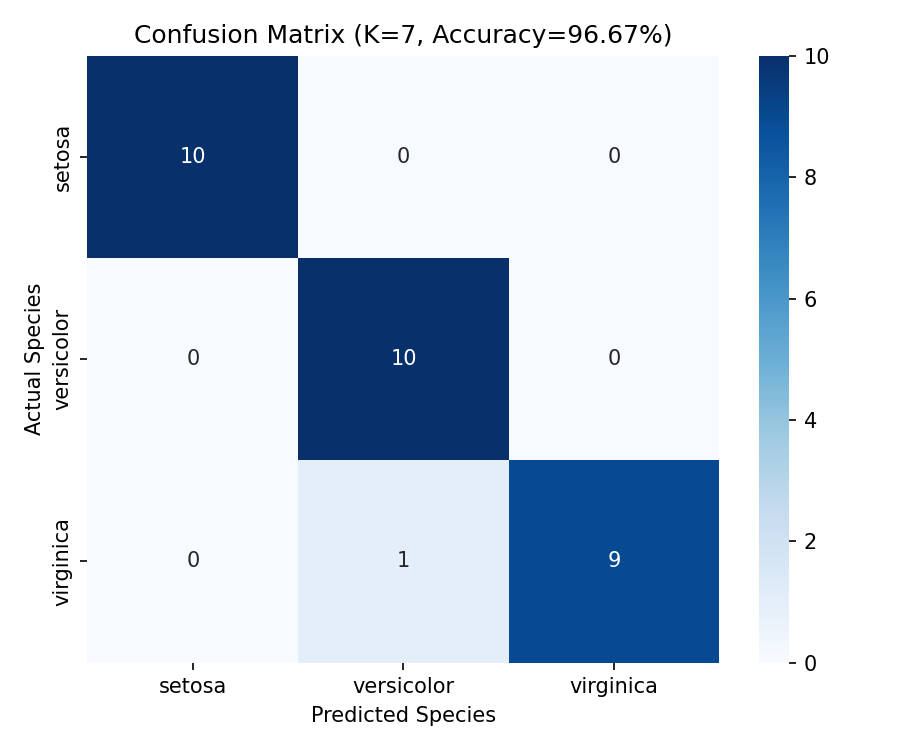
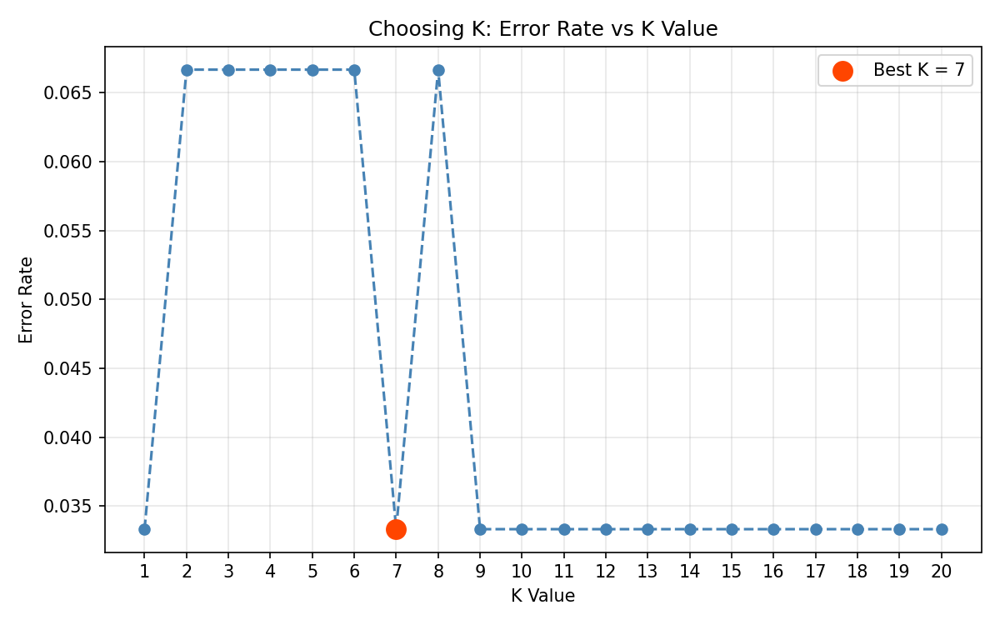

# DecodeLabs-AI-Project2
# Iris Flower Classification using KNN

A supervised machine learning project built as **Project 2: Data Classification Using AI** for the DecodeLabs Industrial Training Kit (Batch 2026).

## 📌 Overview

This project builds a classification model that predicts the species of an Iris flower (Setosa, Versicolor, or Virginica) based on four measurements: sepal length, sepal width, petal length, and petal width.

## 🎯 Objective

- Load and understand the classic Iris dataset
- Split data into training and testing sets
- Apply the K-Nearest Neighbors (KNN) classification algorithm
- Evaluate performance using a confusion matrix and F1 score

## 🛠️ Tech Stack

- Python 3
- scikit-learn
- pandas
- matplotlib / seaborn

## 📊 Pipeline

1. **Input** — Load the Iris dataset (150 samples, 4 features, 3 balanced classes)
2. **Scaling** — Standardize features using `StandardScaler` (fit on training data only)
3. **Split** — 80/20 stratified train-test split
4. **Model Tuning** — Sweep K from 1–20, plot error rate, select optimal K
5. **Train** — Fit a `KNeighborsClassifier`
6. **Evaluate** — Confusion matrix, precision, recall, F1 score

## 📈 Results

| Metric | Score |
|---|---|
| Accuracy | 96.7% |
| F1 Score (macro) | 0.967 |
| Best K | 7 |




## 🚀 How to Run

```bash
pip install scikit-learn pandas matplotlib seaborn
python iris_classification.py
```

## 📁 Files

- `iris_classification.py` — full pipeline script
- `confusion_matrix.png` — model evaluation heatmap
- `k_tuning.png` — K value optimization chart

## 🙌 Acknowledgements

Built as part of the AI Industrial Training Kit at [DecodeLabs](https://www.decodelabs.tech).
